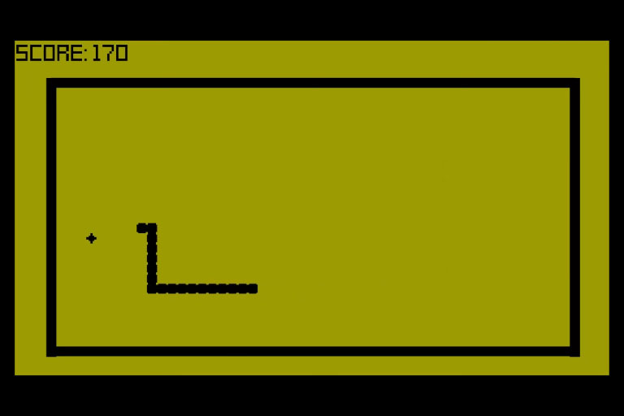

# Snake Game

---

### Description

This is a simple Snake Game implemented in HTML, CSS, and JavaScript. The classic Snake challenge is to control the snake to eat apples, grow longer, and avoid collisions with the walls and itself.

### How to Play

1. Open the `index.html` file in your browser.
2. Use the arrow keys to control the snake's direction.
3. Try to eat apples to grow longer and earn points.
4. Avoid collisions with the walls and the snake's own body.

### Features

- Control the snake's direction with arrow keys.
- Apples appear randomly for the snake to eat.
- Grow longer by eating apples and earn points.
- Game over alert with the option to reload the page.

### How to Contribute

If you want to contribute to the development of the game, follow these steps:

1. Fork the repository.
2. Clone your fork: `git clone https://github.com/YOUR_USERNAME/snake-game.git`
3. Create a branch for your changes: `git checkout -b your-branch`
4. Make your modifications and commit: `git commit -m "Add new features"`
5. Push your changes: `git push origin your-branch`
6. Open a Pull Request on GitHub.

We welcome your contributions! Also, follow me on my social media to support this project and others through this link: [https://linktr.ee/mario.conf](https://linktr.ee/mario.conf).

---

## Juego de la Serpiente

---

### Descripción

Este es un simple juego de la Serpiente implementado en HTML, CSS y JavaScript. El desafío clásico de la Serpiente es controlarla para comer manzanas, crecer y evitar colisiones con las paredes y su propio cuerpo.

### Cómo Jugar

1. Abre el archivo `index.html` en tu navegador.
2. Utiliza las teclas de flecha para controlar la dirección de la serpiente.
3. Intenta comer manzanas para crecer y ganar puntos.
4. Evita colisiones con las paredes y el cuerpo de la serpiente.

### Funcionalidades

- Controla la dirección de la serpiente con las teclas de flecha.
- Las manzanas aparecen aleatoriamente para que la serpiente las coma.
- Crece al comer manzanas y gana puntos.
- Alerta de fin del juego con la opción de recargar la página.

### Cómo Contribuir

Si quieres contribuir al desarrollo del juego, sigue estos pasos:

1. Haz un fork del repositorio.
2. Clona tu fork: `git clone https://github.com/TU_USUARIO/snake-game.git`
3. Crea una rama para tus cambios: `git checkout -b tu-rama`
4. Realiza tus modificaciones y haz commit: `git commit -m "Añadir nuevas funcionalidades"`
5. Sube tus cambios: `git push origin tu-rama`
6. Abre un Pull Request en GitHub.

¡Agradecemos tus contribuciones! Además, sígueme en mis redes sociales para apoyar este proyecto y otros a través de este enlace: [https://linktr.ee/mario.conf](https://linktr.ee/mario.conf).
